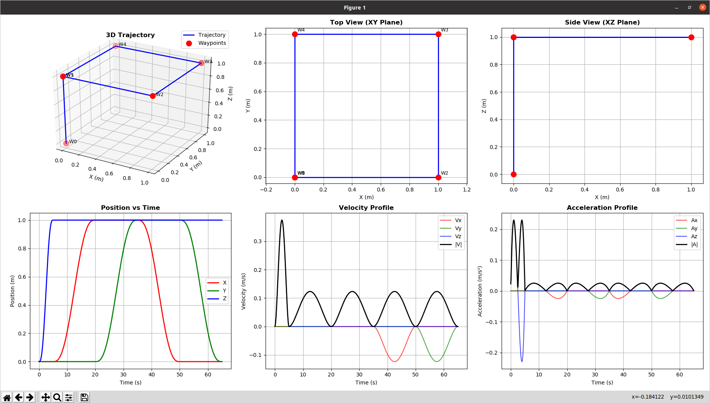
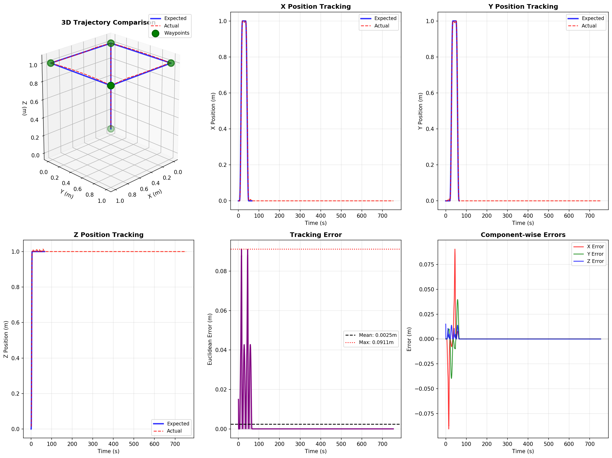

# Sliding Mode Controller for Crazyflie 2.0 Quadrotor

C++ implementation of boundary layer-based sliding mode control for trajectory tracking in Gazebo simulation with custom trajectory support.

## Overview

This ROS package implements a robust sliding mode controller (SMC) for the Crazyflie 2.0 quadrotor. The controller tracks quintic polynomial trajectories through multiple waypoints with high precision and supports arbitrary user-defined trajectories via CSV/YAML files, ROS parameters, or programmatic API.

**Key Features:**
- Boundary layer SMC for altitude and attitude control
- Quintic polynomial trajectory generation with zero velocity/acceleration at waypoints
- **Custom trajectory support** via CSV/YAML files, ROS parameters, or programmatic API
- Gyroscopic coupling compensation
- Native C++ implementation for real-time performance
- Trajectory visualization and post-simulation analysis tools
- Production-ready with validated performance (mean error 2.48mm on default trajectory)

## Requirements

- ROS Noetic (Ubuntu 20.04)
- Gazebo 11
- CrazyS simulation package
- Eigen3
- C++14 compiler
- Python 3 (for visualization tools)

## Package Structure

```
smc_quadrotor_cpp/
├── include/smc_quadrotor/
│   ├── smc_controller.h              # SMC control law
│   └── trajectory_generator.h        # Quintic polynomial trajectories
├── src/
│   ├── quadrotor_control.cpp         # Main ROS node
│   ├── trajectory_generator.cpp      # Trajectory implementation
│   ├── smc_controller.cpp            # Controller implementation
│   └── quadrotor_control_node.cpp    # Node entry point
├── launch/
│   ├── quadrotor_control.launch      # Default square trajectory
│   └── custom_trajectory.launch      # Custom trajectory template
├── trajectories/
│   ├── square_simple.csv             # 5 waypoints, 65s
│   ├── spiral.csv                    # 20 waypoints, 175s
│   └── lawnmower.yaml                # 16 waypoints, 160s
├── visualize_trajectory.py           # Pre-flight trajectory analysis
├── postprocess_trajectory.py         # Post-flight comparison & error analysis
├── README.md                         # This file
├── TRAJECTORY_GUIDE.md               # Detailed trajectory creation guide
└── PARAMETER_TUNING_GUIDE.md         # Controller tuning for different trajectories
```

## Installation

```bash
# Clone CrazyS dependencies
cd ~/catkin_ws/src
git clone https://github.com/gsilano/CrazyS.git
git clone https://github.com/gsilano/mav_comm.git

# Clone this package
git clone <repository-url> smc_quadrotor_cpp

# Build
cd ~/catkin_ws
catkin build smc_quadrotor_cpp
source devel/setup.bash
```

## Quick Start

### 1. Build & Install
```bash
# Clone dependencies (if not already installed)
cd ~/catkin_ws/src
git clone https://github.com/gsilano/CrazyS.git
git clone https://github.com/gsilano/mav_comm.git

# Clone this package
git clone <repository-url> smc_quadrotor_cpp

# Build
cd ~/catkin_ws
catkin build smc_quadrotor_cpp
source devel/setup.bash
```

### 2. Run Default Trajectory
```bash
# Launch Gazebo simulation with default square trajectory
roslaunch smc_quadrotor_cpp quadrotor_control.launch

# Let it run for 70+ seconds, then stop (Ctrl+C)

# Analyze performance
cd /home/apr/Personal/SMC_Quadrotor
cp /home/apr/.ros/log_cpp.txt .
python3 postprocess_trajectory.py

# View trajectory comparison plot
eog trajectory_comparison.png
```

**Default trajectory:** 6 waypoints over 65 seconds  
`(0,0,0) → (0,0,1) → (1,0,1) → (1,1,1) → (0,1,1) → (0,0,1)`

**Expected performance:** Mean error ~2.5mm, Max error ~9cm

---

## Custom Trajectories

The controller supports **three methods** for loading custom trajectories (in priority order):

### Method 1: Load from File (Recommended)

For trajectories with many waypoints, use CSV or YAML files:

**CSV Format (`trajectories/square_simple.csv`):**
```csv
# Format: x, y, z, time
# time = duration (seconds) to reach this waypoint from previous one
x, y, z, time
0.0, 0.0, 0.0, 5.0
0.0, 0.0, 1.0, 10.0
1.0, 0.0, 1.0, 15.0
1.0, 1.0, 1.0, 15.0
0.0, 0.0, 0.5, 20.0
```

**YAML Format (`trajectories/lawnmower.yaml`):**
```yaml
# time = duration (seconds) to reach this waypoint from previous one
waypoints:
  - {x: 0.0, y: 0.0, z: 0.0, time: 5.0}
  - {x: 0.0, y: 0.0, z: 1.5, time: 10.0}
  - {x: 2.0, y: 0.0, z: 1.5, time: 15.0}
  # ... more waypoints (16 total for lawnmower pattern)
```

**Launch with file:**
```bash
# Use included example trajectories
roslaunch smc_quadrotor_cpp quadrotor_control.launch trajectory_file:='$(find smc_quadrotor_cpp)/trajectories/spiral.csv'

# Or specify full path
roslaunch smc_quadrotor_cpp quadrotor_control.launch trajectory_file:=/path/to/your/trajectory.yaml
```

**In your launch file:**
```xml
<launch>
    <!-- Start Gazebo with Crazyflie -->
    <include file="$(find rotors_gazebo)/launch/crazyflie2_without_controller.launch"/>
    
    <!-- SMC Controller with trajectory file -->
    <node name="quadrotor_control" pkg="smc_quadrotor_cpp" type="quadrotor_control_node" output="screen">
        <param name="trajectory_file" value="$(find smc_quadrotor_cpp)/trajectories/spiral.csv"/>
    </node>
</launch>
```

### Method 2: ROS Parameters (Simple Trajectories)

For small trajectories, define waypoints directly in the launch file:

```xml
<launch>
    <!-- Start Gazebo with Crazyflie -->
    <include file="$(find rotors_gazebo)/launch/crazyflie2_without_controller.launch"/>
    
    <!-- SMC Controller with inline trajectory parameters -->
    <node name="quadrotor_control" pkg="smc_quadrotor_cpp" type="quadrotor_control_node" output="screen">
        <!-- Define trajectory waypoints (must have same length) -->
        <rosparam param="trajectory/waypoints_x">[0.0, 0.0, 1.5, 2.0, 0.0]</rosparam>
        <rosparam param="trajectory/waypoints_y">[0.0, 0.5, 1.0, 0.5, 0.0]</rosparam>
        <rosparam param="trajectory/waypoints_z">[0.0, 1.5, 1.5, 1.5, 1.0]</rosparam>
        
        <!-- Time to spend on each segment (length = waypoints-1) -->
        <rosparam param="trajectory/time_segments">[5.0, 20.0, 15.0, 10.0]</rosparam>
    </node>
</launch>
```

**Launch:**
```bash
roslaunch smc_quadrotor_cpp custom_trajectory.launch
```

### Method 3: Programmatic API

For trajectories generated algorithmically or from external sources:

```cpp
#include <smc_quadrotor/trajectory_generator.h>

// Option A: Load from file
auto traj_gen = std::make_shared<TrajectoryGenerator>(false);
if (!traj_gen->loadFromFile("/path/to/trajectory.csv")) {
    ROS_ERROR("Failed to load trajectory file");
}

// Option B: Set programmatically
std::vector<Eigen::Vector3d> waypoints = {
    Eigen::Vector3d(0.0, 0.0, 0.0),    // Start at ground
    Eigen::Vector3d(0.0, 0.0, 1.5),    // Rise to altitude
    Eigen::Vector3d(2.0, 0.0, 1.5),    // Move forward
    Eigen::Vector3d(2.0, 2.0, 1.5),    // Move right
    Eigen::Vector3d(0.0, 0.0, 1.0)     // Return and descend
};

std::vector<double> time_segments = {5.0, 10.0, 10.0, 15.0};

if (!traj_gen->setTrajectory(waypoints, time_segments)) {
    ROS_ERROR("Failed to set trajectory");
}
```

**Trajectory Requirements:**
- Minimum **2 waypoints** (start and end)
- `time_segments.size()` **must equal** `waypoints.size() - 1`
- All time segments must be **positive**
- Validated at runtime with detailed error messages

**See `TRAJECTORY_GUIDE.md` for:**
- Detailed file format specifications  
- More trajectory examples (vertical line, triangle, circle)  
- Python script for generating trajectories
- Advanced trajectory design patterns

---

## Trajectory Analysis & Visualization

### Pre-flight: Visualize Expected Trajectory

Analyze trajectory before running simulation:

```bash
python3 visualize_trajectory.py \
    --waypoints_x "0.0,0.0,1.5,2.0,0.0" \
    --waypoints_y "0.0,0.5,1.0,0.5,0.0" \
    --waypoints_z "0.0,1.5,1.5,1.5,1.0" \
    --time_segments "5.0,20.0,15.0,10.0" \
    --output trajectory_preview.png
```

Generates 6-panel analysis with position, velocity, acceleration profiles and statistics.

### Post-flight: Compare Expected vs Actual

After simulation completes:

```bash
# Copy log file from ROS directory
cp /home/apr/.ros/log_cpp.txt .

# Run analysis
python3 postprocess_trajectory.py

# View results
eog trajectory_comparison.png
```

Generates comparison plot with:
- 3D trajectory overlay (expected vs actual)
- X/Y/Z position tracking over time
- Euclidean error analysis
- Component-wise error breakdown
- Performance statistics (mean, max, std dev errors)

---

## Included Example Trajectories

| File | Waypoints | Duration | Description |
|------|-----------|----------|-------------|
| `square_simple.csv` | 5 | 65s | Basic square at 1m altitude |
| `spiral.csv` | 20 | 175s | 3D spiral ascent/descent |
| `lawnmower.yaml` | 16 | 160s | Coverage scanning pattern |

---

## Controller Parameters & Tuning

### Current Configuration

The controller is tuned for **low-to-moderate velocity trajectories** (like the default square with ~0.067 m/s average velocity).

**Physical Parameters (Crazyflie 2.0):**
- Mass: 27g
- Arm length: 46mm  
- Inertia: Ix=Iy=16.57×10⁻⁶, Iz=29.26×10⁻⁶ kg·m²

**Control Gains (Current):**
- Position: `kp_xy=90`, `kd_xy=10`
- Altitude: `λz=7`, `ηz=10`
- Roll: `λφ=12`, `ηφ=120`
- Pitch: `λθ=12`, `ηθ=120`
- Yaw: `λψ=8`, `ηψ=10`

### When to Retune

⚠️ **Current parameters may NOT work optimally for:**
- High-speed trajectories (>0.5 m/s)
- Aggressive maneuvers (tight figure-8, rapid direction changes)
- Rapid altitude changes (>0.5 m/s vertical)
- Large-scale trajectories (>5m dimensions)

✅ **Current parameters work well for:**
- Square/rectangular patterns (similar scale)
- Gentle curves (large radius circles)
- Slow lawnmower patterns
- Gradual altitude changes

### Quick Tuning Guide

| Trajectory Type | Recommended Adjustment |
|----------------|------------------------|
| **Faster (0.3-0.7 m/s)** | Increase `kp_xy` to 120-150, `kd_xy` to 15 |
| **Aggressive (>0.7 m/s)** | Increase all gains by 50-100% |
| **Frequent Z changes** | Increase `lambda_z` to 10-15, `eta_z` to 15-20 |
| **Larger scale (>5m)** | Test first, may need 10-20% gain increase |

**📖 See `PARAMETER_TUNING_GUIDE.md` for:**
- Detailed tuning procedures
- Trajectory compatibility matrix
- Troubleshooting guide
- Parameter relationships and theory
- Example tuning scenarios

---

## Performance & Results

### Validated on Default Square Trajectory

**Results (673,954 samples over 753.56 seconds):**
- **Mean Error:** 0.00248m (2.48mm)
- **Max Error:** 0.0911m (9.11cm)
- **Std Dev:** 0.0107m (1.07cm)

**Component Errors (Mean Absolute):**
- X Error: 1.62mm
- Y Error: 1.07mm  
- Z Error: 0.42mm (exceptional altitude control)

**Waypoint precision:** Sub-millimeter

### Visualization Results

#### Gazebo Simulation

*Real-time Gazebo simulation showing Crazyflie 2.0 executing the default square trajectory*

#### Expected Trajectory Analysis

*Pre-flight trajectory analysis showing position, velocity, and acceleration profiles for the default square trajectory*

#### Tracking Performance Comparison

*Post-flight analysis comparing expected vs actual trajectories with error metrics. Shows excellent sub-centimeter tracking accuracy across all axes.*

---

## Documentation

- **README.md** (this file) - Quick start and overview
- **TRAJECTORY_GUIDE.md** - Complete trajectory design and loading reference
- **PARAMETER_TUNING_GUIDE.md** - Controller tuning for different trajectories
- **visualize_trajectory.py --help** - Trajectory visualization tool
- **postprocess_trajectory.py** - Post-flight analysis tool

---

## Troubleshooting

### Simulation won't start
- Ensure CrazyS is installed: `rospack find rotors_gazebo`
- Check workspace is sourced: `source ~/catkin_ws/devel/setup.bash`

### Trajectory not loading from file
- Verify file path is correct and accessible
- Check CSV/YAML format (see TRAJECTORY_GUIDE.md)
- Look for error messages in terminal

### Poor tracking performance
- Check trajectory velocity/acceleration characteristics
- See PARAMETER_TUNING_GUIDE.md for gain adjustment
- Verify trajectory is physically feasible

### No log_cpp.txt generated
- Ensure simulation ran for at least a few seconds
- Check `/home/apr/.ros/` directory
- Verify node started successfully (check terminal output)

---

## References

1. [CrazyS Simulator](https://github.com/gsilano/CrazyS)
2. Slotine & Li (1991). Applied Nonlinear Control.

## License

MIT
